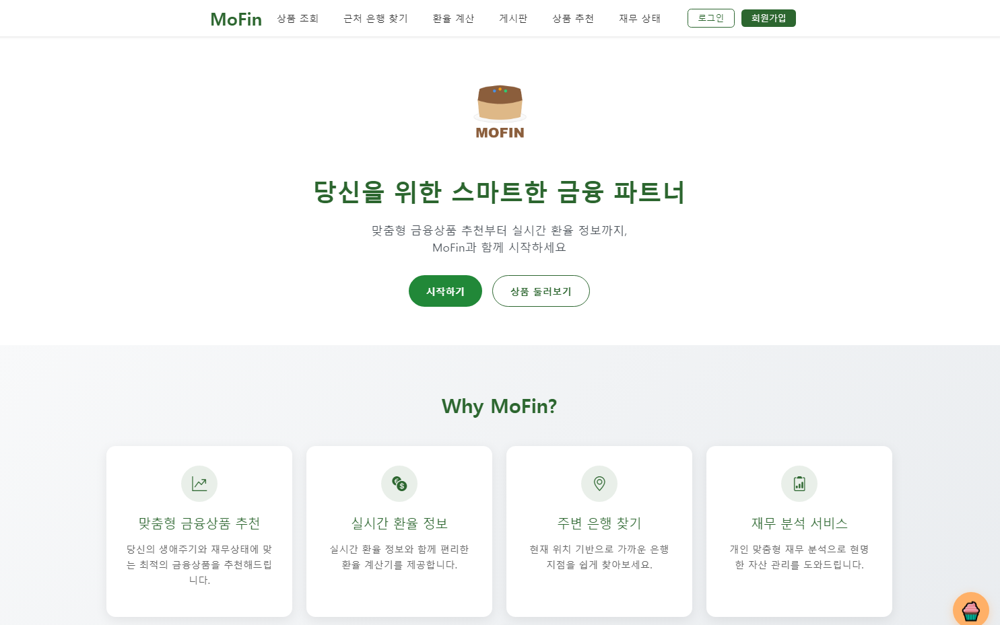
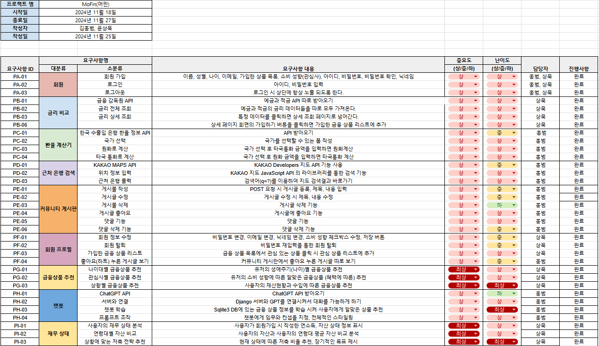
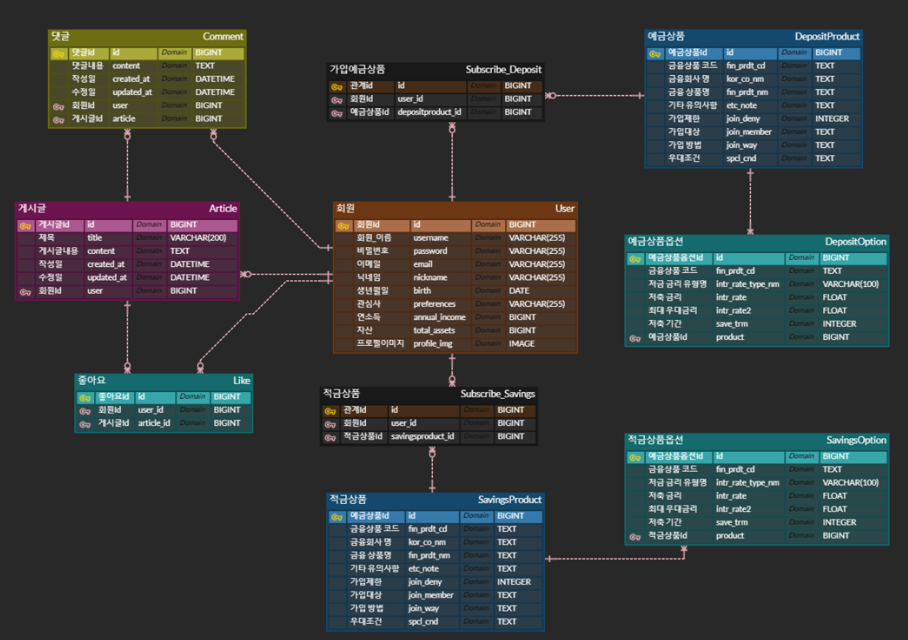
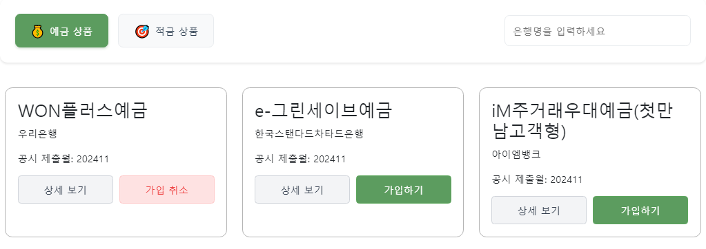
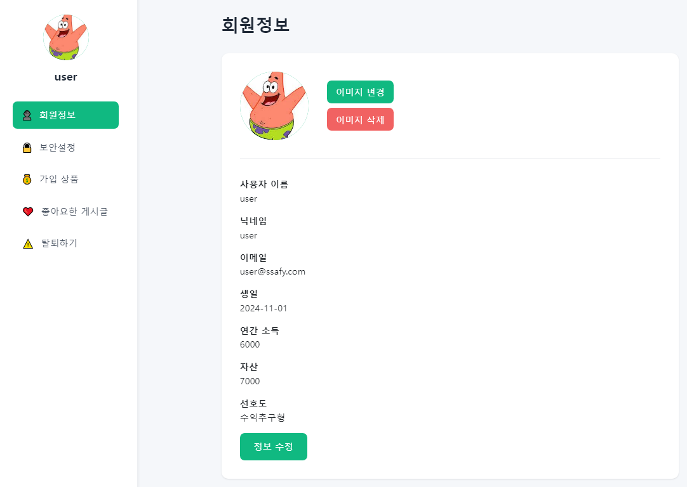
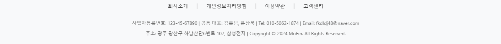
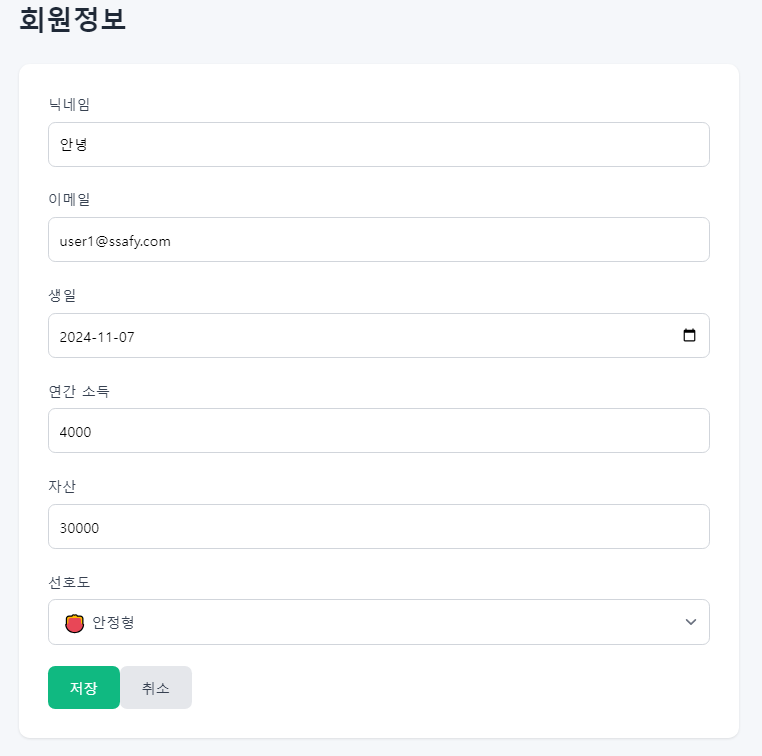

# 10-pjt
# MoFin (Money & Finance)


### 프로젝트 개요
- 프로젝트 기간: 2023.11.18 ~ 2023.11.26
- 금융 상품 추천 및 금융 정보 제공 서비스
- Django REST Framework + Vue.js 기반의 풀스택 웹 애플리케이션

### 서비스 소개
- 돈을 의미하는 Money 와 자산 관리를 뜻하는 Finance 의 앞글자를 따서 만든 합성어로, 사용자들의 자산을 머핀처럼 맛있게 관리할 수 있게끔 사용자의 나이대에 알맞고, 관심사에 적합한 금융 상품들을 추천해주는 서비스 입니다 ! 

### 주요 기능
- 금융 상품(예금/적금) 조회 및 비교
- 실시간 환율 계산
- 주변 은행 검색
- 금융 커뮤니티(게시판)
- 개인화된 금융 상품 추천
- 사용자의 재무 상태 분석

### Mofin HomePage


### [요구사항 명세서]<br>


### [ERD 작성]

-> 각 필요 기능들을 토대로 PK와 FK를 구분하고 관계차수를 계산해서 ERD를 작성했다.

-> N:M 관계는 중간다리 역할을 하는 중개테이블을 만들어서 서로 참조할 수 있도록 하였다.
### 기술 스택

#### Frontend
- Vue 3
- Pinia (상태 관리)
- Vue Router
- Axios

#### Backend
- Django 4.2
- Django REST Framework
- SQLite3
- dj-rest-auth (인증)

#### External APIs
- 금융감독원 금융상품 API
- 한국수출입은행 환율 API
- Kakao Maps API

### 설치 및 실행

#### Backend 설정

#### 가상환경 생성 및 활성화
python -m venv venv

Windows: venv/Scripts/activate 

Mac: source venv/bin/activate 

#### 패키지 설치
pip install -r requirements.txt

#### 데이터베이스 마이그레이션
python manage.py migrate

#### 서버 실행
python manage.py runserver

#### 패키지 설치
npm install

#### 개발 서버 실행
npm run dev:all

### 프로젝트 구조
```markdown
project-root/
├── back/
│   ├── accounts/
│   ├── articles/
│   ├── exchange/
│   ├── recommendations/
│   └── savings/
└── front/
     src/
    ├── public/
    ├── server/
    └── src/
        ├── components/
        ├── router/
        ├── stores/
        └── views/
```

## 11월 / 18일(월)
1. 회원 <br>
-> 회원가입, 로그인, 로그아웃을 나누어서 각자의 기능에 필요한 데이터 및 컴포넌트 배치 구조를 정함

2. 금리 비교 <br>
-> API 받기, 금리 전체 및 상세 조회에 대한 기능, 상세 페이지에서의 필요한 기능 명시

3. 환율 계산기 <br>
-> 환율 API, 국가 선택 후 타국통화 및 자국통화로 전환 해주는 기능

4. 근처 은행 검색 <br>
-> KAKAO API MAPS API 받기, 위치 정보 입력 후 근처 은행을 표시해주는 기능

5. 커뮤니티 게시판 <br>
-> 게시물 CRUD, 댓글 CRUD, 좋아요 기능

6. 회원 프로필 <br>
-> 회원정보 수정 및 탈퇴, 가입한 금융상품 보기, 좋아요 누른 게시글 보기

7. 금융상품 추천 <br>
-> 나이대별, 관심사별, 상황별 금융상품 추천

8. 재무상태 분석 <br>
-> 현재 자산 상태 분석, 연령대별 자산 비교, 저축 전략 제시


### [회원가입 기능 구현]
- #### 목표
    Custom User와 Serializer를 이용해서 DRF를 통해 Vue와 연동시켜 회원가입 기능을 구현하는 것

- ### 문제점 1
    Django Rest Framework 서버의 회원가입 url에서 기존 폼을 제외한 추가 작성 폼을 추가하지 못하는 어려움 발생

- ### 해결방안
    serializers.py에 RegisterSerailizer를 import 받아서 CustomRegisterSerailizer에 상속 후 입력 폼을 추가하였다.
    ```python
    from rest_framework import serializers
    from dj_rest_auth.registration.serializers import RegisterSerializer


    class CustomRegisterSerializer(RegisterSerializer):
        nickname = serializers.CharField(
            required=False,
            max_length=255
        )
        birth = serializers.DateField(
            required=False,
        )
        preference = serializers.CharField(
            required=False,
            max_length=255
        )

        def get_cleaned_data(self):
            cleaned_data = {
                'username': self.validated_data.get('username', ''),
                'email': self.validated_data.get('email', ''),
                'password1': self.validated_data.get('password1', ''),
                'nickname': self.validated_data.get('nickname', ''),
                'preference': self.validated_data.get('preference', ''),
            }
            
            birth = self.validated_data.get('birth', None)
            if birth:
                cleaned_data['birth'] = str(birth)

            return cleaned_data
    ```


- ### 문제점 2
    입력 폼은 추가 했지만, 여전히 DB에는 저장이 되지 않는 문제 발생!

- ### 해결방안
    models.py에 DefaultAccountAdapter를 import 받아와서 CustomAccountAdapter를 만들어줌
    ```python
    from allauth.account.adapter import DefaultAccountAdapter

    class CustomAccountAdapter(DefaultAccountAdapter):
        def save_user(self, request, user, form, commit=True):
            """
            Saves a new `User` instance using information provided in the
            signup form.
            """
            from allauth.account.utils import user_email, user_field, user_username
            data = form.cleaned_data
            first_name = data.get("first_name")
            last_name = data.get("last_name")
            email = data.get("email")
            username = data.get("username")
            nickname = data.get("nickname")
            birth = data.get("birth")
            preference = data.get("preference")
            user_email(user, email)
            user_username(user, username)
            if first_name:
                user_field(user, "first_name", first_name)
            if last_name:
                user_field(user, "last_name", last_name)
            if nickname:
                user_field(user, "nickname", nickname)
            if birth:
                user_field(user, "birth", birth)
            if preference:
                user_field(user, "preference", preference)
            if "password1" in data:
                user.set_password(data["password1"])
            else:
                user.set_unusable_password()
            self.populate_username(request, user)
            if commit:
                # Ability not to commit makes it easier to derive from
                # this adapter by adding
                user.save()
            return user
    ```
## 11 / 19일(화)
### [근처 은행 위치 정보 가져오기] - 홍범
- ### 목표<br>
1. KAKAO MAP API를 받아와서 사용자로 하여금 찾고자 하는 위치를 입력하게 하고, 찾고자 하는 은행을 선택하고 "은행 찾기" 버튼을 누르면 해당 위치의 주변에 있는 은행들을 지도상에 표시

2. 사용자의 위치정보를 GPS로 받아서 사용자가 있는 곳을 기반해서 주위에 있는 선택한 은행들을 지도상에 표시

- ### 문제점 1
    위치와 은행을 어떻게 입력시켜야 지도상에서 정보를 받아올 수 있을지 난관 봉착

- ### 해결방안
    keywordSearch라는 함수를 이용해서 위치 검색어와 선택한 은행의 단어 일부가 일치하면 카카오맵의 Place정보와 일치하는 결과를 받을 수 있었음
    ```JavaScript
    const ps = new window.kakao.maps.services.Places();
    const query = `${searchQuery.value} ${selectedBank.value}`;

    ps.keywordSearch(query, (result, status) => {
    if (status === window.kakao.maps.services.Status.OK) {
        result.forEach(location => {
        addMarker(location);
        });
    ```

- ### 문제점 2
    어떻게 사용자의 위치를 받아올 것이며, 사용자의 위치를 어떻게 표시할지 고민

- ### 해결방안
    geolocation을 활용해서 현재 위치의 위도와 경도 정보를 받아온 후 LatLng 함수를 통해서 해당 위도와 경도를 저장
    ```javascript
    if (navigator.geolocation) {
        navigator.geolocation.getCurrentPosition(
            position => {
                const userLat = position.coords.latitude;
                const userLng = position.coords.longitude;
                const userPosition = new window.kakao.maps.LatLng(userLat, userLng)
    ```

### [환율 계산기 기능 구현] - 홍범
- ### 목표
1. 한국 수출입 은행에서 환율 정보 API를 받아오기


2. 환율을 토대로 자국통화를 입력하면 타국통화로 계산해주기


3. 반대로 타국통화를 입력하면 자국통화로 계산해주기

- ### 문제점1
    변환 방향을 설정해줄 때 어떤 기준으로 통화 계산이 달라질지 고민

- ### 해결방안
    변환 방향 설정 시 value를 각각 부여하고 v-model로 감싼 후 추후에 v-if로 조건을 걸어주면서 결과 필터링
    ```html
    <label for="conversion-direction">변환 방향:</label>
    <select v-model="selectedDirection">
        <option value="toForeign">원화 → 외국 통화</option>
        <option value="toKrw">외국 통화 → 원화</option>
    </select>
                            .
                            .
                            .

    <div v-if="exchangeResult !== null">
      <p v-if="conversionDirection === 'toForeign'">
        {{ formatNumber(calculationAmount) }} KRW는 {{ formatNumber(exchangeResult) }} {{ targetCurrency }}입니다.
      </p>
      <p v-if="conversionDirection === 'toKrw'">
        {{ formatNumber(calculationAmount) }} {{ targetCurrency }}는 {{ formatNumber(exchangeResult) }} KRW입니다.
      </p>
    </div>
    ```

- ### 문제점2
    데이터중 ,로 구분되어있는 통화때문에 데이터를 받아오지 못하는 상황 발생

- ### 해결방안
    parseFloat으로 데이터를 응답받을 때 ,를 여백없는 빈 공간으로 만든 후 받아옴
    ```javascript
    let rate = parseFloat(response.data.rate.replace(",", ""))
    ```

### [금융 상품(예금, 적금) 정보 조회]
#### 예적금 상품에 들어가는 상품 및 옵션 정의
옵션은 금융 상품 코드를 이용하여 일치하는 금융 코드의 상품과 ForeignKey 로 연결하여 금융 상품 조회 시 각각의 금융 상품에 여러 옵션이 있을 경우 모든 옵션이 조회될 수 있도록 구성했습니다.

```python
class DepositProducts(models.Model):  # 예금상품
    fin_prdt_cd = models.TextField()  # 금융상품 코드
    kor_co_nm = models.TextField()  # 금융회사 명
    fin_prdt_nm = models.TextField()  # 금융 상품명
    etc_note = models.TextField()  # 기타 유의사항
    join_deny = models.IntegerField()  # 가입제한 Ex) 1: 제한없음, 2: 서민전용, 3: 일부제한
    join_member = models.TextField()  # 가입대상
    join_way = models.TextField()  # 가입방법
    spcl_cnd = models.TextField()  # 우대조건


class DepositOptions(models.Model):  # 예금상품 옵션
    product = models.ForeignKey(DepositProducts, on_delete=models.CASCADE)  # 예금상품
    fin_prdt_cd = models.TextField()  # 금융상품 코드
    intr_rate_type_nm = models.CharField(max_length=100)  # 저축 금리 유형명
    intr_rate = models.FloatField(null=True)  # 저축 금리
    intr_rate2 = models.FloatField(null=True)  # 최고 우대금리
    save_trm = models.IntegerField()  # 저축 기간


class SavingsProducts(models.Model):  # 적금상품
    fin_prdt_cd = models.TextField()  # 금융상품 코드
    kor_co_nm = models.TextField()  # 금융회사 명
    fin_prdt_nm = models.TextField()  # 금융 상품명
    etc_note = models.TextField()  # 기타 유의사항
    join_deny = models.IntegerField()  # 가입제한 Ex) 1: 제한없음, 2: 서민전용, 3: 일부제한
    join_member = models.TextField()  # 가입대상
    join_way = models.TextField()  # 가입방법
    spcl_cnd = models.TextField()  # 우대조건


class SavingsOptions(models.Model):  # 적금상품 옵션
    product = models.ForeignKey(SavingsProducts, on_delete=models.CASCADE)  # 적금상품
    fin_prdt_cd = models.TextField()  # 적금상품 코드
    intr_rate_type_nm = models.CharField(max_length=100)  # 저축 금리 유형명
    intr_rate = models.FloatField(null=True)  # 저축 금리
    intr_rate2 = models.FloatField(null=True)  # 최고 우대금리
    save_trm = models.IntegerField()  # 저축 기간
```

상품 조회 페이지에서 예금 상품, 적금 상품 버튼을 만들고 각각의 버튼을 클릭 시 해당 상품들이 조회되도록 구성했습니다.




## 11월 20일(수)
### [게시판 기능 및 댓글 기능 구현] - 홍범
- ### 목표
    유저들이 서로 게시글을 올려 게시글을 작성하고, 댓글을 달아서 소통할 수 있는 자유게시판 구축

- ### 문제점 1
    전체 게시글 조회 및 상세 게시글 조회 시 데이터를 받아오지 못하는 문제 발생

- ### 해결방안
    url을 Django서버로 받아와서 제대로된 url에 요청 및 응답을 받을 수 있도록 수정
    ```javaScript
    onMounted(() => {
    axios({
        method: 'get',
        url: 'http://127.0.0.1:8000/articles/articles/',
        headers: store.token ? { Authorization: `Token ${store.token}` } : {}
    })
        .then((response) => {
        if (Array.isArray(response.data)) {
            articles.value = response.data;
        } else if (response.data.results) {
            articles.value = response.data.results;
        } else {
            console.error('올바르지 않은 API 데이터 구조:', response.data);
            articles.value = [];
        }
        })
        .catch((error) => {
        console.error('게시글 데이터를 가져오는 중 오류가 발생했습니다:', error);
        });
    });
    ``` 

- ### 문제점 2
    댓글 수정 및 삭제 시 작성한 사용자에게만 버튼이 보이도록 구현

- ### 해결방안
    로그인할 때 사용자 정보를 auth.js에서 fetchUserInfo 함수를 통해 userId(pk)를 가져옴.
    그 다음 현재 접속한 사용자(authStore.userId)와 댓글을 작성한 사용자(user.id)와 같으면 삭제 및 수정 버튼이 보이도록 구현
    ```html
    <h2>댓글</h2>
    <ul>
      <li v-for="comment in comments" :key="comment.id" class="comment-item">
        <!-- 수정 모드가 아닐 때 -->
        <div v-if="editingCommentId !== comment.id">
          <p>{{ comment.content }}</p>
          <div class="comment-meta">
            <span>{{ formatDate(comment.created_at) }}</span>
            <span>작성자: {{ comment.user.nickname }}</span>
            <!-- 자신이 작성한 댓글만 수정/삭제 버튼 표시 -->
            <div v-if="comment.user.id === authStore.userId" class="comment-actions">
              <button @click="startEdit(comment)">수정</button>
              <button @click="deleteComment(comment.id)">삭제</button>
            </div>
            <!-- <span>작성자: {{ comment.user.nickname }} (ID: {{ comment.user.id }})</span>
            <span>로그인 사용자 ID: {{ authStore.userId }}</span> -->
          </div>
        </div>
    ```

## 11월 21일(목)
### [프로필 페이지 작성, 회원 정보 수정, 비밀번호 변경, 회원 탈퇴 기능]
#### 프로필 페이지에서 사용자의 기본적인 정보 제공 및 정보 수정 기능 제공

추가적으로 사용자와 금융 상품을 N:M 관계를 가지도록 함으로써 가입 상품 리스트를 프로필 페이지에서
볼 수 있도록 기능을 구현해야 함. 
```python
class User(AbstractUser):
    nickname = models.CharField(max_length=255, blank=False)
    birth = models.DateField(blank=True, null=True)
    preference = models.TextField(blank=True, null=True)
    # 기존에 serializer로 정의하고 있지 않던  subscribe 필드들
    # 어떻게 처리할지 알아보는 중에 있음
    subscribe_deposits = models.ManyToManyField(DepositProducts, blank=True)
    subscribe_savings = models.ManyToManyField(SavingsProducts, blank=True)
```

위의 subscribe_deposits 와 subscribe_savings 필드를 정의하고 중개 테이블을 이용해 유저가 가입한 상품 목록을 추가할 예정.


하지만 회원가입을 진행하는 과정에서 데이터를 데이터베이스에 등록할 때 제대로 저장되지 않고 있는 문제가 발생함. Registeration_Serializer 와 adapter, UserDetailsSerializer 를 작성하는 과정에서 어떻게 코드를 작성해야 등록되는지 알아보고 있는 상태

추가적으로 이메일에 대한 정보가 회원 프로필에 출력되고 있지 않고 비밀번호 변경 시 현재 비밀번호의 값이 어떤 값이 들어가도 변경이 되는 시스템 결함을 수정해야 함.

#### ERD 수정 및 요구사항 명세서를 새롭게 작성하였음.
physical name 을 실제 모델에 맞게 수정, 프로젝트 진행사항 체크

#### 예금과 적금 상품을 구독하고 프로필 페이지에 추가
회원 프로필 페이지에서 가입 상품 버튼을 클릭하면 예금 상품과 적금 상품을 각각 나눠서 어떤 상품에 가입했는지 추가
- 가입 상품 페이지에서도 상세 정보 보기 페이지와 구독 및 취소 버튼까지 활성화

#### settings 에서 CustomUserDetailsSerializer 등록
토큰을 이용한 USER 정보 가져오기

### [금융 상품과 사용자 N:M relationship 구성]
User 에 가입 예금 상품 출력을 위한 subscribe_deposits, 적금 상품을 위한 subscribe_savings 필드를 만들어 상품을 조회할 때 원하는 상품이 있을 경우 가입하기 버튼을 눌러 회원 프로필에서도 볼 수 있도록 구성했습니다.
```python
class User(AbstractUser):
    nickname = models.CharField(max_length=255, blank=False)
    birth = models.DateField(blank=True, null=True)
    preference = models.TextField(blank=True, null=True)
    subscribe_deposits = models.ManyToManyField(DepositProducts, blank=True)
    subscribe_savings = models.ManyToManyField(SavingsProducts, blank=True)
    annual_income = models.BigIntegerField(blank=True, null=True, help_text="연 소득(만원)")
    total_assets = models.BigIntegerField(blank=True, null=True, help_text="총 자산(만원)")
    profile_img = models.ImageField(
        upload_to=user_profile_path,
        default=None, 
        blank=True, 
        null=True,
        verbose_name='프로필 이미지'
    )
```

## 11월 22일(금)
### [챗봇 기능 구현] - 홍범

- ### 목표
    챗봇을 사용함으로써 사용자가 직접 요청한 조건의 상품을 알맞게 추천 받을 수 있도록 금융 상품 추천

- ### 문제점 1
    서버와 GPT의 호환 문제

- ### 해결방안
    front 프로젝트 최상위 폴더에서 server 폴더를 새로 만든 후 그 안에 server.js 파일을 만들고 API KEY관리를 위해 .env 파일을 생성.<br>
    ```bash
    npm init -y
    npm install express cors openai dotenv
    cd server
    node server.js
    npm install --save-dev concurrently
    npm run dev:all
    ```
    그후 Component에 ChatBot폴더와 ChatBot.vue 파일을 만든 후 백엔드 서버 요청 로직과 챗봇의 전체적인 디자인을 관리
    ```bash
    npm install lucide-vue-next
    ```  

- ### 문제점 2
    Django 프로젝트의 Sqlite DB에 있는 금융 상품을 챗봇에게 학습

- ### 해결방안
    sqlite의 DB와 연결하도록 sqlite를 따로 설치하고, 경로를 지정
    ```bash
    npm install sqlite
    ```
    ```javascript
    const dbPath = path.resolve(__dirname, '../../back/db.sqlite3')
            const db = new sqlite3.Database(dbPath);
            const query = `
                SELECT 
                    d.kor_co_nm as bank_name,
                    d.fin_prdt_nm as product_name,
                    ROUND(o.intr_rate, 2) as base_rate,
                    ROUND(o.intr_rate2, 2) as prime_rate,
                    o.save_trm as term
                FROM savings_depositproducts d
                LEFT JOIN savings_depositoptions o 
                ON d.fin_prdt_cd = o.fin_prdt_cd
                ORDER BY o.intr_rate2 DESC
                LIMIT 10
            `;

            db.all(query, [], async (err, products) => {
                if (err) {
                    console.error('DB 오류:', err);
                    db.close();
                    return res.status(500).json({ error: err.message });
                }

                const completion = await openai.chat.completions.create({
                    model: 'gpt-3.5-turbo',
                    messages: [
                        {
                            role: 'system',
                            content: `...`
                        },
                        {
                            role: 'user',
                            content: `현재 상품 목록: ${JSON.stringify(products)}\n\n문의사항: ${message}`
                        }
                    ],
                    temperature: 0.7,
                    max_tokens: 500
                });

                db.close();
                res.json({ message: completion.choices[0].message.content });
            });
        } catch (error) {
            console.error('오류:', error);
            res.json({ 
                message: "..." 
            });
        }
    });
    ```
    -> Django DB와 연결 및 학습

### [회원 정보 페이지에 프로필 이미지, 연소득, 자산 추가]
#### 프로필 페이지 구성



## 11월 23일(토)
### [상품 추천 페이지 추가]
일단 고금리의 상품둘을 사람들에게 추천해줄 수 있도록 높은 금리 순으로 금융 상품을 추천해주도록 만들었습니다.

### [Footer 작성]
- 홈페이지 하단에 그럴듯한 인포메이션을 추가했습니다.
- 회사소개, 개인정보처리방침, 이용약관, 고객센터, 연락처와 주소 등에 관한 정보가 들어있습니다.


### [회원 관련 정보 모두 수정할 수 있도록 수정]
- 원래 유저 이름과 이메일만 변경할 수 있도록 구성되어 있었지만 유저 이름(아이디)은 바꿀 수 없도록 하고 닉네임, 이메일, 생일, 연간 소득, 자산, 선호도를 추가적으로 수정 가능하도록 만들었습니다.



### [재무 상태 페이지 추가]
- 사용자가 회원가입 시 작성한 연 소득, 자산, 생일(나이) 를 이용하여 사용자의 재무 상태가 어떤지 알려주는 페이지를 추가했습니다.

- 사용자의 연령대의 평균 자산과 비교해 어떤 전략을 통해 자산을 늘려나갈 수 있을지 방향성을 제시해주는 멘트가 출력됩니다.


## 11월 24일(일)
### 사용자에 대한 상품 추천 알고리즘 수정
- 연령층 별로 금융 상품을 추천할 때 추천 금리 수준을 어느 정도 수정하였습니다.
    예금 (2.15 -  3.55) % 
    고금리 : 3.1 - 3.55
    중금리 : 2.6 - 3.1
    저금리 : 2.15 - 2.6

    적금 (2 - 8) % 
    고금리 : 7 - 8
    중금리 : 4 - 7
    저금리 : 2 - 4

    청년기
    예금 : 고금리
    적금 : 고금리

    사회초년기
    예금 : 중금리
    적금 : 고금리

    자산형성기
    예금 : 고금리
    적금 : 고금리

    자산안정기
    예금 : 중금리
    적금 : 중금리

    노년기
    예금 : 중금리
    적금 : 저금리

- 홈페이지의 통일성을 위한 디자인을 수정했습니다.

    버튼의 색상을 통일해보았습니다.


