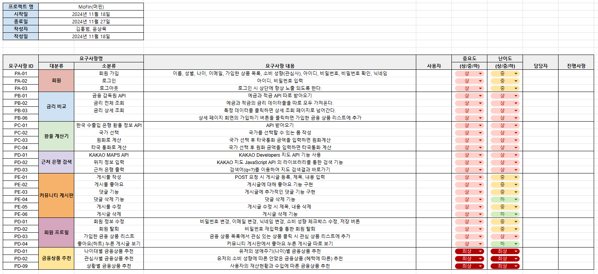
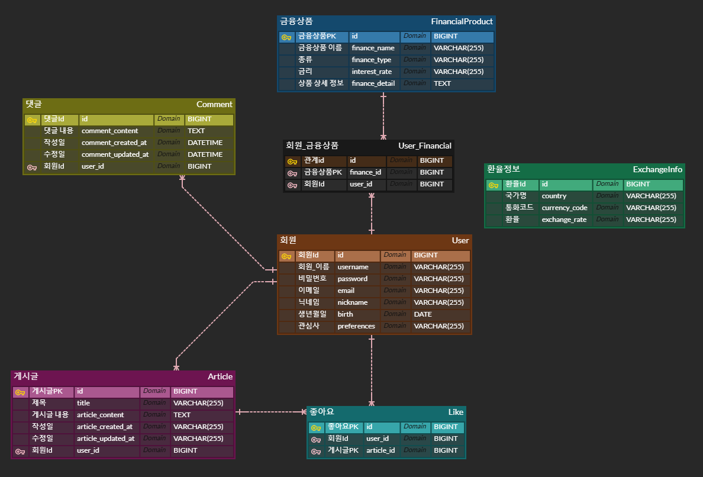

# 10-pjt

## 11월 / 18일(월)
### [요구사항 명세서]<br>

1. 회원 <br>
-> 회원가입, 로그인, 로그아웃을 나누어서 각자의 기능에 필요한 데이터 및 컴포넌트 배치 구조를 정함

2. 금리 비교 <br>
-> API 받기, 금리 전체 및 상세 조회에 대한 기능, 상세 페이지에서의 필요한 기능 명시

3. 환율 계산기 <br>
-> 환율 API, 국가 선택 후 타국통화 및 자국통화로 전환 해주는 기능

4. 근처 은행 검색 <br>
-> KAKAO API MAPS API 받기, 위치 정보 입력 후 근처 은행을 표시해주는 기능

5. 커뮤니티 게시판 <br>
-> 게시물 CRUD, 댓글 CRUD, 좋아요 기능

6. 회원 프로필 <br>
-> 회원정보 수정 및 탈퇴, 가입한 금융상품 보기, 좋아요 누른 게시글 보기

7. 금융상품 추천 <br>
-> 나이대별, 관심사별, 상황별 금융상품 추천

### [ERD 작성]

-> 각 필요 기능들을 토대로 PK와 FK를 구분하고 관계차수를 계산해서 ERD를 작성했다.

-> N:M 관계는 중간다리 역할을 하는 중개테이블을 만들어서 서로 참조할 수 있도록 하였다.


### [회원가입 기능 구현]
- #### 목표
    Custom User와 Serializer를 이용해서 DRF를 통해 Vue와 연동시켜 회원가입 기능을 구현하는 것

- #### 문제점 1
    Django Rest Framework 서버의 회원가입 url에서 기존 폼을 제외한 추가 작성 폼을 추가하지 못하는 어려움 발생

- #### 해결방안
    serializers.py에 RegisterSerailizer를 import 받아서 CustomRegisterSerailizer에 상속 후 입력 폼을 추가하였다.
    ```python
    from rest_framework import serializers
    from dj_rest_auth.registration.serializers import RegisterSerializer


    class CustomRegisterSerializer(RegisterSerializer):
        nickname = serializers.CharField(
            required=False,
            max_length=255
        )
        birth = serializers.DateField(
            required=False,
        )
        preference = serializers.CharField(
            required=False,
            max_length=255
        )

        def get_cleaned_data(self):
            cleaned_data = {
                'username': self.validated_data.get('username', ''),
                'email': self.validated_data.get('email', ''),
                'password1': self.validated_data.get('password1', ''),
                'nickname': self.validated_data.get('nickname', ''),
                'preference': self.validated_data.get('preference', ''),
            }
            
            birth = self.validated_data.get('birth', None)
            if birth:
                cleaned_data['birth'] = str(birth)

            return cleaned_data
    ```


- #### 문제점 2
    입력 폼은 추가 했지만, 여전히 DB에는 저장이 되지 않는 문제 발생!

- #### 해결방안
    models.py에 DefaultAccountAdapter를 import 받아와서 CustomAccountAdapter를 만들어줌
    ```python
    from allauth.account.adapter import DefaultAccountAdapter

    class CustomAccountAdapter(DefaultAccountAdapter):
        def save_user(self, request, user, form, commit=True):
            """
            Saves a new `User` instance using information provided in the
            signup form.
            """
            from allauth.account.utils import user_email, user_field, user_username
            data = form.cleaned_data
            first_name = data.get("first_name")
            last_name = data.get("last_name")
            email = data.get("email")
            username = data.get("username")
            nickname = data.get("nickname")
            birth = data.get("birth")
            preference = data.get("preference")
            user_email(user, email)
            user_username(user, username)
            if first_name:
                user_field(user, "first_name", first_name)
            if last_name:
                user_field(user, "last_name", last_name)
            if nickname:
                user_field(user, "nickname", nickname)
            if birth:
                user_field(user, "birth", birth)
            if preference:
                user_field(user, "preference", preference)
            if "password1" in data:
                user.set_password(data["password1"])
            else:
                user.set_unusable_password()
            self.populate_username(request, user)
            if commit:
                # Ability not to commit makes it easier to derive from
                # this adapter by adding
                user.save()
            return user
    ```
## 11 / 19일(화)
### [근처 은행 위치 정보 가져오기] - 홍범
- #### 목표<br>
1. KAKAO MAP API를 받아와서 사용자로 하여금 찾고자 하는 위치를 입력하게 하고, 찾고자 하는 은행을 선택하고 "은행 찾기" 버튼을 누르면 해당 위치의 주변에 있는 은행들을 지도상에 표시

2. 사용자의 위치정보를 GPS로 받아서 사용자가 있는 곳을 기반해서 주위에 있는 선택한 은행들을 지도상에 표시

- #### 문제점 1
    위치와 은행을 어떻게 입력시켜야 지도상에서 정보를 받아올 수 있을지 난관 봉착

- #### 해결방안
    keywordSearch라는 함수를 이용해서 위치 검색어와 선택한 은행의 단어 일부가 일치하면 카카오맵의 Place정보와 일치하는 결과를 받을 수 있었음
    ```JavaScript
    const ps = new window.kakao.maps.services.Places();
    const query = `${searchQuery.value} ${selectedBank.value}`;

    ps.keywordSearch(query, (result, status) => {
    if (status === window.kakao.maps.services.Status.OK) {
        result.forEach(location => {
        addMarker(location);
        });
    ```

- #### 문제점 2
    어떻게 사용자의 위치를 받아올 것이며, 사용자의 위치를 어떻게 표시할지 고민

- #### 해결방안
    geolocation을 활용해서 현재 위치의 위도와 경도 정보를 받아온 후 LatLng 함수를 통해서 해당 위도와 경도를 저장
    ```javascript
    if (navigator.geolocation) {
        navigator.geolocation.getCurrentPosition(
            position => {
                const userLat = position.coords.latitude;
                const userLng = position.coords.longitude;
                const userPosition = new window.kakao.maps.LatLng(userLat, userLng)
    ```

### [환율 계산기 기능 구현] - 홍범
- #### 목표
1. 한국 수출입 은행에서 환율 정보 API를 받아오기


2. 환율을 토대로 자국통화를 입력하면 타국통화로 계산해주기


3. 반대로 타국통화를 입력하면 자국통화로 계산해주기

- #### 문제점1
    변환 방향을 설정해줄 때 어떤 기준으로 통화 계산이 달라질지 고민

- #### 해결방안
    변환 방향 설정 시 value를 각각 부여하고 v-model로 감싼 후 추후에 v-if로 조건을 걸어주면서 결과 필터링
    ```html
    <label for="conversion-direction">변환 방향:</label>
    <select v-model="selectedDirection">
        <option value="toForeign">원화 → 외국 통화</option>
        <option value="toKrw">외국 통화 → 원화</option>
    </select>
                            .
                            .
                            .

    <div v-if="exchangeResult !== null">
      <p v-if="conversionDirection === 'toForeign'">
        {{ formatNumber(calculationAmount) }} KRW는 {{ formatNumber(exchangeResult) }} {{ targetCurrency }}입니다.
      </p>
      <p v-if="conversionDirection === 'toKrw'">
        {{ formatNumber(calculationAmount) }} {{ targetCurrency }}는 {{ formatNumber(exchangeResult) }} KRW입니다.
      </p>
    </div>
    ```

- #### 문제점2
    데이터중 ,로 구분되어있는 통화때문에 데이터를 받아오지 못하는 상황 발생

- #### 해결방안
    parseFloat으로 데이터를 응답받을 때 ,를 여백없는 빈 공간으로 만든 후 받아옴
    ```javascript
    let rate = parseFloat(response.data.rate.replace(",", ""))
    ```